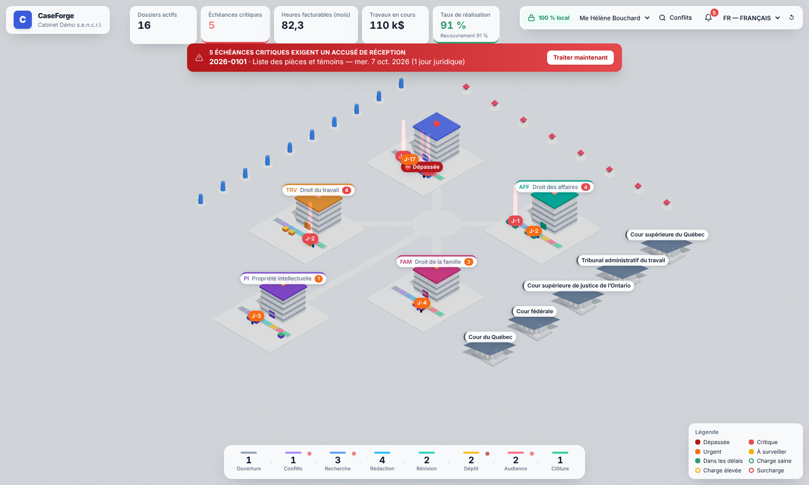
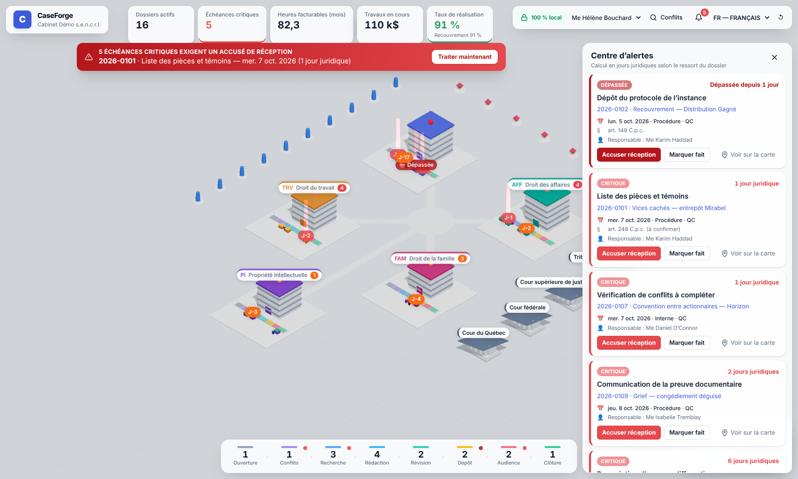
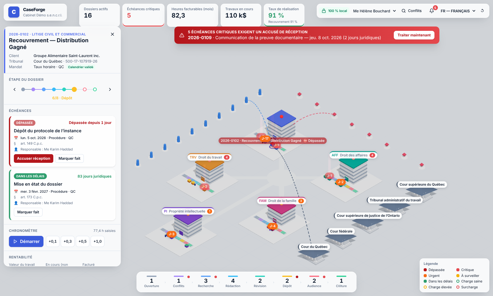
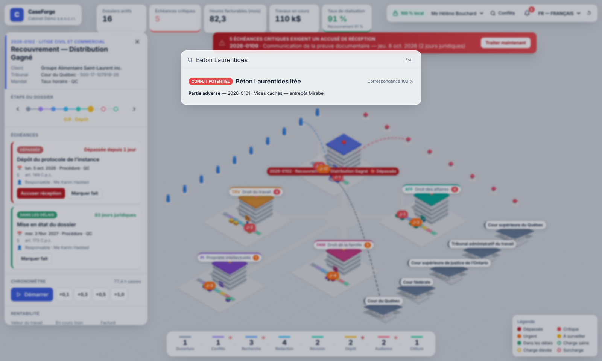

# CaseForge

**Le centre de commandement du cabinet d'avocats canadien.** CaseForge présente l'ensemble des dossiers, des échéances et de l'équipe sous la forme d'un campus isométrique 3D, comme dans un jeu de stratégie. L'application est **100 % locale** : aucune donnée ne quitte le poste.



> **Statut :** v0.1, premier écran fonctionnel. Les calendriers du Québec, de l'Ontario et des Cours fédérales ont été validés ; la C.-B., l'Alberta et une partie du catalogue de délais restent **à valider** (voir [Droit modélisé](#droit-modélisé-et-points-à-valider)).

---

## Pourquoi un cabinet paierait

| Problème quotidien | Ce que fait CaseForge | Valeur |
|---|---|---|
| Délai de prescription ou de procédure manqué (1re cause de réclamations en responsabilité professionnelle) | Échéances calculées en **jours juridiques** propres au ressort, avec une colonne lumineuse sur la carte, une bannière impossible à fermer, un **accusé de réception nominatif journalisé** et une notification système | Évite des sinistres à 6 chiffres et protège la prime d'assurance |
| « Où en est ce dossier ? » | Chaque pôle a son quai de pipeline à 8 étapes (Ouverture → Clôture), et les dossiers glissent d'une étape à l'autre | Vue instantanée, sans réunion |
| Temps non saisi (WIP perdu) | Chronomètre en un clic et saisie rapide par tranches de 0,1 h | Récupère des heures facturables |
| Conflits d'intérêts | Recherche floue (Ctrl+K) sur clients, parties adverses et noms antérieurs, qui ignore les accents et les formes juridiques | Vérification en quelques secondes au lieu de plusieurs minutes |
| Rentabilité opaque | Marge, budget consommé, WIP, facturé et encaissé par dossier et par pôle, en temps réel | Décisions de tarification éclairées |
| Épuisement professionnel | Anneau de charge sous chaque collaborateur, indice de pression (utilisation et échéances critiques) | Redistribution avant la crise |

## Démarrer

```bash
npm install
npm run rebuild:native   # recompile better-sqlite3 pour l'ABI d'Electron
npm run dev              # application de bureau (Electron + SQLite)

npm run dev:web          # interface seule dans le navigateur (mode démo, IndexedDB)
npm test                 # tests unitaires (calendriers, délais, alertes, conflits, SQLite)
npm run typecheck
npm run package          # installateur Windows / macOS / Linux (electron-builder)
```

> `npm test` utilise better-sqlite3 compilé pour Node. Après `rebuild:native`, relancez `npm rebuild better-sqlite3` pour pouvoir exécuter les tests du dépôt SQLite sous Node.

À la première ouverture, un cabinet de démonstration fictif est créé. Ses échéances sont générées relativement à la date du jour, donc toujours pertinentes. Le bouton ↺ réinitialise la démo.

---

## 1. Architecture

```
┌──────────────────────────── Poste de l'avocat ────────────────────────────┐
│                                                                           │
│  Processus principal Electron (Node)          Renderer (Chromium, sandbox) │
│  ┌──────────────────────────────┐   IPC     ┌───────────────────────────┐ │
│  │ ipc.ts  ← validation entrées │◄─────────►│ api/  (window.caseforge)  │ │
│  │ db/repository.ts             │ preload   │ store/ Zustand            │ │
│  │ db/migrations.ts (user_ver.) │ (context- │ scene/ React Three Fiber  │ │
│  │ notifier.ts → notif. OS      │  Bridge)  │ ui/    panneaux Tailwind  │ │
│  │ security.ts → bloque réseau  │           │ i18n/  fr (défaut), en    │ │
│  └──────────────┬───────────────┘           └─────────────┬─────────────┘ │
│                 │                                         │               │
│        userData/caseforge.sqlite (WAL)           shared/domain (pur TS)   │
│        userData/sauvegardes/ (14 j)              calendriers, délais,     │
│                                                  alertes, KPI, conflits   │
└───────────────────────────────────────────────────────────────────────────┘
                      ✗ aucune connexion sortante ✗
```

**Principes**

- **Local d'abord.** SQLite (better-sqlite3) dans le processus principal est la source de vérité. IndexedDB ne sert qu'au mode démo navigateur (`npm run dev:web`). Les préférences du poste (langue, session, chronomètre en cours) sont dans `localStorage`.
- **Garantie technique contre les fuites** (`src/main/security.ts`) :
  - toute requête réseau du renderer est annulée, sauf le serveur Vite local en développement ;
  - CSP stricte sans origine distante ;
  - aucune permission accordée ;
  - navigation et `window.open` interdits ;
  - polices empaquetées localement (`@fontsource`), aucune ressource CDN (pas d'`Environment` drei ni de `Text`/troika, qui téléchargent des fichiers).
- **Isolation.** `contextIsolation`, `sandbox` et `nodeIntegration: false`. Le renderer n'a accès qu'aux 6 opérations exposées par le preload, et chaque entrée est validée côté main.
- **Domaine pur et testable.** Toute la logique métier (`src/shared/domain`) est en TypeScript sans dépendance. Elle tourne à l'identique dans Electron, dans le navigateur et sous Vitest.
- **Robustesse.**
  - Journal WAL, `foreign_keys` et contraintes `CHECK` sur toutes les énumérations.
  - Migrations versionnées via `PRAGMA user_version`, chacune dans une transaction.
  - Sauvegarde en ligne quotidienne, avec rétention de 14 jours.
  - Instance unique, pour éviter deux écrivains concurrents.
  - Montants en cents et dates civiles `AAAA-MM-JJ` sans fuseau.

## 2. Schéma de la base locale

Défini dans `src/main/db/migrations.ts`.

| Table | Rôle | Colonnes clés |
|---|---|---|
| `settings` | Paramètres du cabinet | `key`, `value` |
| `practice_areas` | Pôles (bâtiments) | `code`, `name`, `color`, `grid_x`, `grid_z` |
| `staff` | Collaborateurs (unités) | `role`, `hourly_rate_cents`, `cost_rate_cents`, `target_hours_week` |
| `parties` | Toutes les personnes et entités connues (base des conflits) | `name`, `kind` (personne/entreprise/tribunal), `aliases_json` |
| `matters` | Dossiers | `number`, `client_id`, `practice_area_id`, `responsible_id`, `stage`, `status`, `jurisdiction`, `court`, `court_file_number`, `fee_arrangement`, `budget_cents` |
| `matter_team` | Équipe d'un dossier | `matter_id`, `staff_id` |
| `matter_parties` | Rôle d'une partie dans un dossier | `role` (client/adverse/liee/avocat_adverse/tribunal) |
| `deadlines` | Échéances | `kind` (prescription/procedure/audience/interne), `due_date`, `legal_basis`, `rule_id`, `trigger_date`, `assigned_to`, `status`, `acknowledged_at/by`, `completed_at` |
| `time_entries` | Saisie de temps | `minutes`, `rate_cents` (figé à la saisie), `billable`, `status` (wip/facture/radie) |
| `invoices` | Factures | `standard_value_cents`, `amount_cents`, `paid_cents` (réalisation et recouvrement) |
| `documents` | Pièces (références vers des **fichiers locaux** seulement) | `category`, `exhibit` (P-1, D-3…), `file_path` |
| `conflict_checks` | Trace des vérifications de conflits (preuve de diligence ; table prête, journalisation à brancher) | `query`, `performed_by`, `results_json` |
| `audit_log` | Journal (accusés de réception, changements d'étape) | `actor`, `action`, `entity`, `entity_id`, `details_json` |

## 3. Structure du projet

```
src/
├── shared/                    # partagé main / renderer, sans dépendance
│   ├── types.ts               # modèle de domaine
│   ├── api.ts                 # contrat CaseForgeApi + canaux IPC
│   ├── seed.ts                # cabinet de démonstration fictif, déterministe
│   └── domain/
│       ├── dates.ts           # arithmétique de dates civiles (UTC)
│       ├── calendar.ts        # jours non juridiques QC / ON / FED
│       ├── deadlineRules.ts   # catalogue de délais + moteur de calcul expliqué
│       ├── alerts.ts          # niveaux d'alerte, accusés de réception
│       ├── metrics.ts         # KPI, charge, rentabilité
│       └── conflicts.ts       # recherche floue de conflits
├── main/                      # processus principal Electron
│   ├── index.ts               # fenêtre, cycle de vie, instance unique
│   ├── security.ts            # blocage réseau, CSP, permissions
│   ├── ipc.ts                 # pont validé
│   ├── notifier.ts            # notifications OS des échéances critiques
│   └── db/                    # connexion, migrations, dépôt (+ tests)
├── preload/index.ts           # contextBridge → window.caseforge
└── renderer/
    ├── index.html
    └── src/
        ├── App.tsx
        ├── api/               # IPC (Electron) ou IndexedDB (démo)
        ├── store/             # Zustand + valeurs dérivées mémoïsées
        ├── i18n/              # fr.ts (défaut), en.ts — typés
        ├── scene/             # carte 3D : layout, bâtiments, dossiers, collaborateurs, tribunaux, liens, caméra
        └── ui/                # barre KPI, bannière, centre d'alertes, panneau de détail, pipeline, conflits
```

## 4. Le premier écran

- **Campus isométrique** (caméra orthographique, angle isométrique vrai de 54,7°) : glisser pour se déplacer, clic droit pour pivoter, molette pour zoomer.
- **Bâtiments** : un par pôle. La hauteur suit le nombre de dossiers actifs, un gyrophare sur le toit indique l'alerte la plus grave du pôle, et une étiquette affiche le compteur d'alertes.
- **Quai de pipeline** devant chaque bâtiment : 8 plateformes colorées. Chaque dossier est un « colis » posé sur l'étape où il se trouve, et il glisse en animation quand l'étape change.
- **Collaborateurs** : ils circulent entre leur bureau et leurs dossiers. L'anneau au sol indique la charge (vert, ambre ou rouge), et 🔥 signale une surcharge.
- **Nœuds externes** : les tribunaux (palais de justice) à l'est, les clients (pylônes bleus) à l'ouest et les parties adverses (prismes rouges) au nord. La sélection d'un élément trace des arcs animés vers ses liens.
- **Panneau contextuel** au clic : pour un dossier, il affiche les étapes, les échéances avec actions, le chronomètre, la rentabilité, l'équipe et les pièces. Il existe aussi pour un pôle, un collaborateur et un tribunal ou une partie. La caméra se recentre sur la sélection.
- **Barre d'indicateurs** : dossiers actifs, échéances critiques, heures facturables du mois, travaux en cours (WIP), taux de réalisation et de recouvrement.
- **Barre de pipeline** : nombre de dossiers par étape, avec filtrage sur la carte.

| Centre d'alertes | Dossier | Conflits (Ctrl+K) |
|---|---|---|
|  |  |  |

## 5. Système d'alertes d'échéances

1. **Calcul en jours juridiques**, selon le ressort du dossier (`calendar.ts`). Un vendredi qui précède l'Action de grâces laisse moins de temps qu'il n'y paraît.
2. **Seuils selon le type de délai** (`alerts.ts`), en jours juridiques restants :

   | Type | Critique | Urgent | À surveiller |
   |---|---|---|---|
   | Prescription | ≤ 10 | ≤ 30 | ≤ 90 |
   | Procédure, audience | ≤ 2 | ≤ 5 | ≤ 20 (15) |
   | Interne | ≤ 1 | ≤ 3 | ≤ 10 |

3. **Escalade visuelle à plusieurs niveaux** :
   - bande colorée sur le dossier ;
   - étiquette « J-n » ;
   - **colonne de lumière et onde au sol** si l'échéance est critique ou dépassée, plus intense tant qu'elle n'est pas accusée ;
   - gyrophare du bâtiment ;
   - point rouge sur l'étape du pipeline ;
   - KPI pulsant.
4. **Bannière persistante**, qui ne se ferme pas tant qu'une échéance critique ou dépassée n'a pas reçu d'**accusé de réception nominatif** (initiales). L'accusé est journalisé dans `audit_log`.
5. **Notification du système d’exploitation**, même si la fenêtre est réduite : vérification toutes les 15 minutes, une seule notification par échéance et par jour.
6. **Moteur de délais expliqué** (`deadlineRules.ts`). Chaque calcul retourne son raisonnement : jour du point de départ exclu, report pour cause de jour non juridique, fondement légal. Par prudence, CaseForge retient la **date brute**, avant report, comme échéance d'alerte.

## Droit modélisé et points à valider

**Validé par un avocat**

| Ressort | Ce qui est modélisé |
|---|---|
| Québec | Jours non juridiques (art. 82 C.p.c.) : samedis, jours fériés de l'art. 61 de la Loi d'interprétation, 26 décembre et 2 janvier. Le calcul des délais suit l'art. 83 : un délai qui expire un samedi ou un jour férié est reporté au premier jour juridique suivant. Les périodes où les tribunaux de première instance ne sont pas tenus de siéger (30 juin – 1er sept., 20 déc. – 7 janv.) sont **signalées** sur les audiences et les délais de procédure, mais **ne suspendent pas** les délais. |
| Québec | Mise en état (art. 173 C.p.c.) : 6 mois (1 an en matière familiale) à compter du protocole présumé accepté, ou accepté ou établi par le tribunal. À défaut de protocole déposé dans le délai, le délai court à compter de la signification de la demande. C'est un **délai de rigueur**. |
| Ontario | Civic Holiday et Remembrance Day sont des « holidays » (r. 1.03) : ils sont exclus et entraînent le report de l'échéance (r. 3.01). |
| Fédéral | Vacances de Noël du 21 décembre au 7 janvier inclusivement, **non comptées** (suspension) pour les délais fixés par les Règles pour déposer, modifier, transmettre ou signifier un document (r. 6(3)), sauf directive contraire de la Cour. |

**Encore à valider**

1. **Fédéral, contrôle judiciaire (par. 18.1(2) de la Loi sur les Cours fédérales)** : ce délai est fixé par la Loi et non par les Règles. Par prudence, CaseForge **ne déduit pas** les vacances de Noël. Faut-il maintenir ce choix ?
2. **Ontario, r. 3.01(1)(b)** : le moteur exclut les jours fériés pour les délais de **moins de 7 jours**, selon notre lecture du texte. Votre note mentionne « 7 jours ou moins ». Lequel retenir ?
3. **Colombie-Britannique et Alberta** : calendriers établis d'après les lois d'interprétation provinciales, avec leurs délais de base (prescriptions de 2 ans et ultimes, réponse et défense). Ils sont signalés « à valider » dans l'interface.
4. **Autres délais du catalogue** non encore confirmés : art. 145, 149 et 360 C.p.c. ; art. 2925 et 2929 C.c.Q. ; prescription et règles 18.01, 61.04 et 48.14 en Ontario.
5. **Autres provinces** : jours fériés nationaux et fins de semaine seulement, pour l'instant.

## Feuille de route suggérée

- Création et édition de dossiers et d'échéances à partir du catalogue de règles, avec l'affichage du raisonnement.
- Import et liaison de pièces locales : hachage SHA-256, cotes automatiques P-1, P-2…, aperçu PDF hors ligne.
- Facturation : préfacture, radiations, TPS/TVQ/TVH selon la province, relevés de fidéicommis (exigences du Barreau et du LSO).
- Chiffrement de la base au repos (SQLCipher), avec mot de passe ou clé du trousseau du système d'exploitation.
- Mode multiposte sur le réseau local (LAN) sans nuage, si un cabinet le demande.
