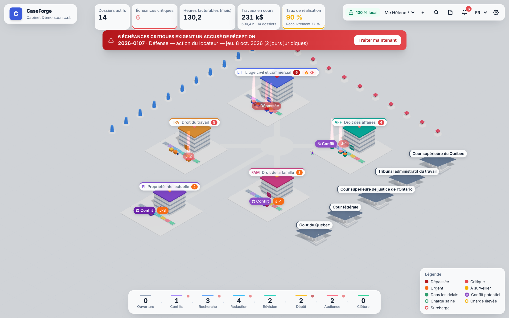
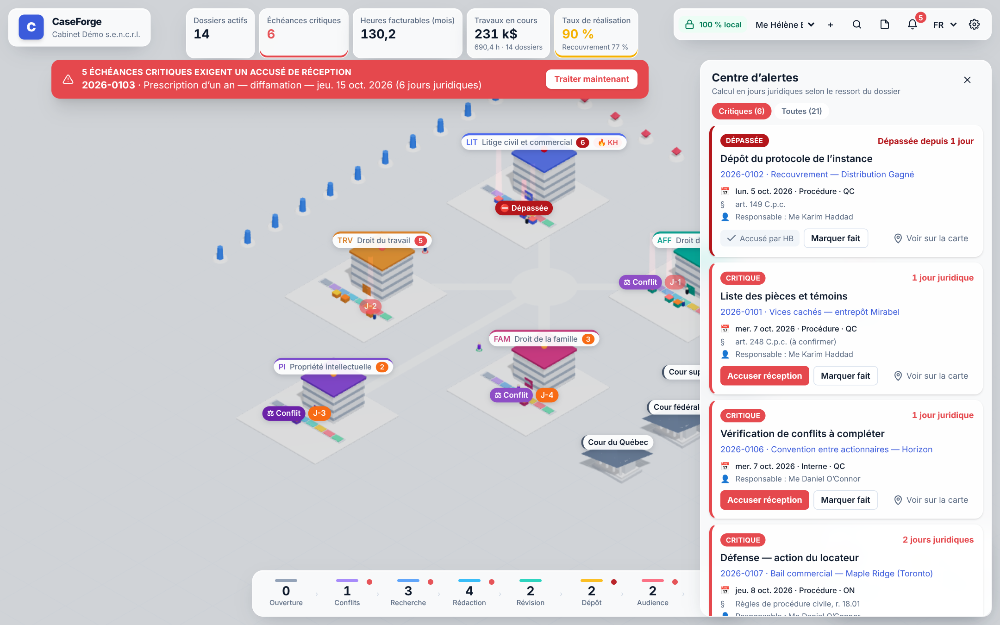
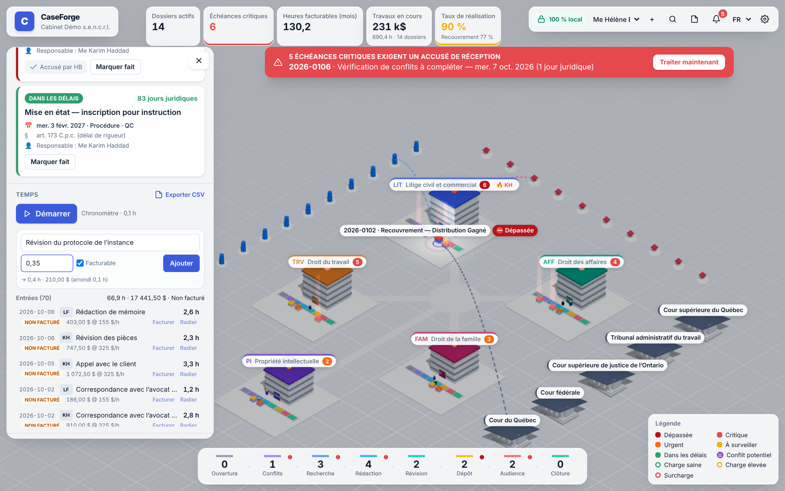
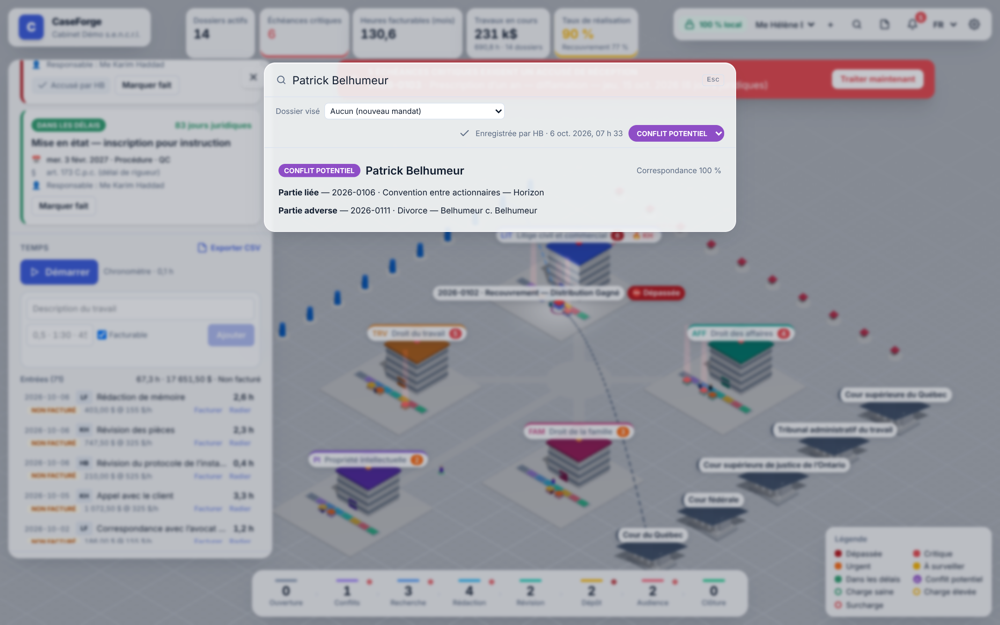
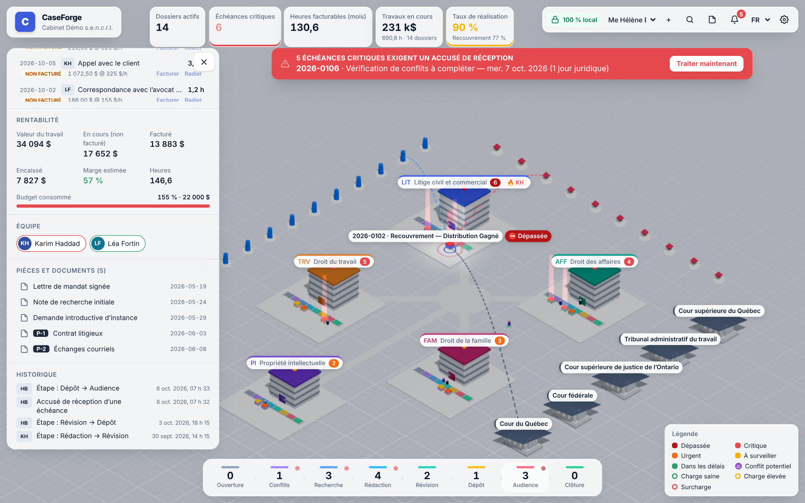
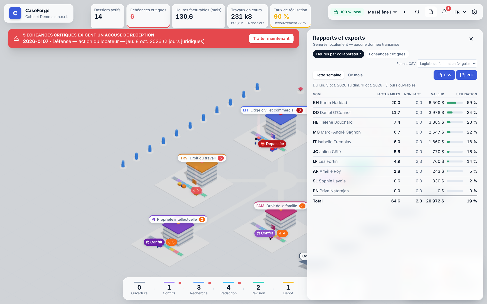
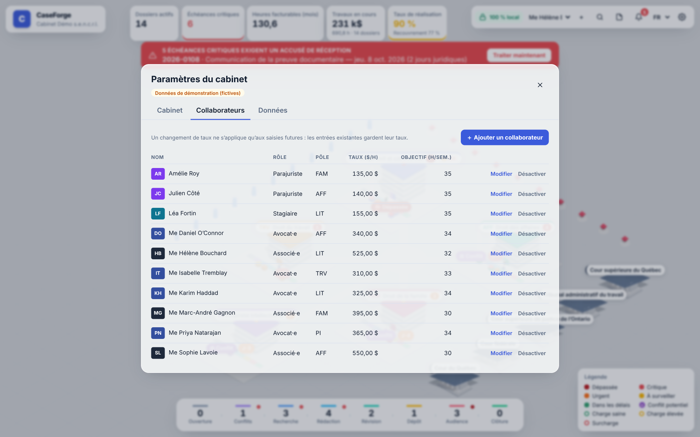

# CaseForge

**Le centre de commandement du cabinet d'avocats canadien.** CaseForge présente l'ensemble des dossiers, des échéances et de l'équipe sous la forme d'un campus isométrique 3D, comme dans un jeu de stratégie. L'application est **100 % locale** : aucune donnée ne quitte le poste.



🎬 Scénario de démo de 60 à 90 secondes : [docs/DEMO.md](docs/DEMO.md)

🌐 **Démo en ligne, sans rien installer : https://okidoki9903.github.io/CaseForge/**

La démo publique est la version navigateur, entièrement côté client :
- les données (fictives) restent dans le navigateur du visiteur, dans IndexedDB ;
- une politique de sécurité stricte (`connect-src 'self'`) interdit au navigateur tout envoi vers un autre serveur ;
- elle est redéployée automatiquement à chaque push sur `main` (`.github/workflows/pages.yml`).

> **Statut :** v0.3, prêt pour une première démonstration à un avocat ; application Electron testée de bout en bout. Les calendriers du Québec, de l'Ontario et des Cours fédérales ont été validés ; la C.-B., l'Alberta et une partie du catalogue de délais restent **à valider** (voir [Droit modélisé](#droit-modélisé-et-points-à-valider)).

---

## Pourquoi un cabinet paierait

| Problème quotidien | Ce que fait CaseForge | Valeur |
|---|---|---|
| Délai de prescription ou de procédure manqué (1re cause de réclamations en responsabilité professionnelle) | Échéances calculées en **jours juridiques** propres au ressort, avec une colonne lumineuse sur la carte, une bannière impossible à fermer, un **accusé de réception nominatif journalisé** et une notification système | Évite des sinistres à 6 chiffres et protège la prime d'assurance |
| « Où en est ce dossier ? » | Chaque pôle a son quai de pipeline à 8 étapes (Ouverture → Clôture), et les dossiers glissent d'une étape à l'autre | Vue instantanée, sans réunion |
| Temps non saisi (WIP perdu) | Chronomètre en un clic, saisie manuelle en 5 secondes, arrondi automatique à 0,1 h, taux figé, statuts facturé ou radié, export CSV vers le logiciel de facturation | Récupère des heures facturables et donne une vue claire du WIP |
| Conflits d'intérêts | Recherche floue (Ctrl+K) sur clients, parties adverses et noms antérieurs, **enregistrée automatiquement** avec statut et auteur ; dossiers concernés signalés sur la carte | Vérification en quelques secondes et preuve de diligence pour le Barreau |
| Rentabilité opaque | Marge, budget consommé, WIP, facturé et encaissé par dossier et par pôle, en temps réel | Décisions de tarification éclairées |
| Épuisement professionnel | Anneau de charge sous chaque collaborateur, indice de pression (utilisation et échéances critiques) | Redistribution avant la crise |

## Démarrer

```bash
npm install
npm run rebuild:native   # recompile better-sqlite3 pour l'ABI d'Electron
npm run dev              # application de bureau (Electron + SQLite)

npm run dev:web          # interface seule dans le navigateur (mode démo, IndexedDB)
npm test                 # 72 tests unitaires (domaine + SQLite)
npm run test:e2e         # test de bout en bout de l'application Electron réelle (13 vérifications)
npm run typecheck
npm run demo:capture     # rejoue le scénario de démo : captures (+ vidéo)
npm run package          # installateur Windows / macOS / Linux (electron-builder)
```

- **Module natif.** better-sqlite3 est compilé soit pour Node (`npm test`), soit pour Electron (`npm run dev`).
  - Après `rebuild:native`, relancez `npm run rebuild:node` avant `npm test` ; `npm run test:e2e` fait les deux bascules automatiquement.
  - `rebuild:native` force la recompilation (`electron-rebuild -f`) : sans cela, un marqueur laissé par `npm rebuild` fait croire à tort que le module est déjà prêt pour Electron.
  - Si l'application démarre avec le mauvais module, elle affiche un message clair avec la commande à lancer, au lieu d'une fenêtre blanche.
- **Dossier de données.** Par défaut, les données vont dans le dossier `userData` du système. La variable `CASEFORGE_DATA_DIR=/chemin` en choisit un autre : poste partagé, installation portable ou démonstration sur des données jetables.
- **Premier lancement.** Un écran d'accueil en 4 étapes s'affiche, puis on choisit :
  - **« Commencer avec la démo »** : un cabinet fictif de 14 dossiers, dont les échéances sont recalculées à partir de la date du jour ;
  - **« Créer un cabinet vide »**.
  - On peut changer d'avis plus tard dans Paramètres → Données, avec confirmation, car les données actuelles sont remplacées.

---

## 1. Architecture

```
┌──────────────────────────── Poste de l'avocat ────────────────────────────┐
│                                                                           │
│  Processus principal Electron (Node)          Renderer (Chromium, sandbox) │
│  ┌──────────────────────────────┐   IPC     ┌───────────────────────────┐ │
│  │ ipc.ts  ← validation entrées │◄─────────►│ api/  (window.caseforge)  │ │
│  │ db/repository.ts             │ preload   │ store/ Zustand            │ │
│  │ db/migrations.ts (user_ver.) │ (context- │ scene/ React Three Fiber  │ │
│  │ notifier.ts → notif. OS      │  Bridge)  │ ui/    panneaux Tailwind  │ │
│  │ security.ts → bloque réseau  │           │ i18n/  fr (défaut), en    │ │
│  └──────────────┬───────────────┘           └─────────────┬─────────────┘ │
│                 │                                         │               │
│        userData/caseforge.sqlite (WAL)           shared/domain (pur TS)   │
│        userData/sauvegardes/ (14 j)              calendriers, délais,     │
│                                                  alertes, KPI, conflits   │
└───────────────────────────────────────────────────────────────────────────┘
                      ✗ aucune connexion sortante ✗
```

**Principes**

- **Local d'abord.** SQLite (better-sqlite3) dans le processus principal est la source de vérité. IndexedDB ne sert qu'au mode démo navigateur (`npm run dev:web`). Les préférences du poste (langue, session, chronomètre en cours) sont dans `localStorage`.
- **Garantie technique contre les fuites** (`src/main/security.ts`) :
  - toute requête réseau du renderer est annulée, sauf le serveur Vite local en développement ;
  - CSP stricte sans origine distante ;
  - aucune permission accordée ;
  - navigation et `window.open` interdits ;
  - polices empaquetées localement (`@fontsource`), aucune ressource CDN (pas d'`Environment` drei ni de `Text`/troika, qui téléchargent des fichiers).
- **Isolation.** `contextIsolation`, `sandbox` et `nodeIntegration: false`. Le renderer n'a accès qu'aux opérations exposées par le preload (`src/shared/api.ts`), et chaque entrée est validée côté main. Les règles métier (arrondi, transitions de statut, initiales) sont partagées entre SQLite et le mode démo pour ne jamais diverger.
- **Export de fichiers.** Le seul fichier que l'application écrit hors de sa base est celui que l'utilisateur choisit dans la boîte de dialogue native (Electron), ou un téléchargement local dans le navigateur.
- **Domaine pur et testable.** Toute la logique métier (`src/shared/domain`) est en TypeScript sans dépendance. Elle tourne à l'identique dans Electron, dans le navigateur et sous Vitest.
- **Robustesse.**
  - Journal WAL, `foreign_keys` et contraintes `CHECK` sur toutes les énumérations.
  - Migrations versionnées via `PRAGMA user_version`, chacune dans une transaction.
  - Sauvegarde en ligne quotidienne, avec rétention de 14 jours.
  - Instance unique, pour éviter deux écrivains concurrents.
  - Montants en cents et dates civiles `AAAA-MM-JJ` sans fuseau.

## 2. Schéma de la base locale

Défini dans `src/main/db/migrations.ts` (v1 : schéma initial ; v2 : statuts des vérifications de conflits et index d'audit).

| Table | Rôle | Colonnes clés |
|---|---|---|
| `settings` | Paramètres du cabinet | `key`, `value` |
| `practice_areas` | Pôles (bâtiments) | `code`, `name`, `color`, `grid_x`, `grid_z` |
| `staff` | Collaborateurs (unités) | `role`, `hourly_rate_cents`, `cost_rate_cents`, `target_hours_week` |
| `parties` | Toutes les personnes et entités connues (base des conflits) | `name`, `kind` (personne/entreprise/tribunal), `aliases_json` |
| `matters` | Dossiers | `number`, `client_id`, `practice_area_id`, `responsible_id`, `stage`, `status`, `jurisdiction`, `court`, `court_file_number`, `fee_arrangement`, `budget_cents` |
| `matter_team` | Équipe d'un dossier | `matter_id`, `staff_id` |
| `matter_parties` | Rôle d'une partie dans un dossier | `role` (client/adverse/liee/avocat_adverse/tribunal) |
| `deadlines` | Échéances | `kind` (prescription/procedure/audience/interne), `due_date`, `legal_basis`, `rule_id`, `trigger_date`, `assigned_to`, `status`, `acknowledged_at/by`, `completed_at` |
| `time_entries` | Saisie de temps | `minutes`, `rate_cents` (figé à la saisie), `billable`, `status` (wip/facture/radie) |
| `invoices` | Factures | `standard_value_cents`, `amount_cents`, `paid_cents` (réalisation et recouvrement) |
| `documents` | Pièces (références vers des **fichiers locaux** seulement) | `category`, `exhibit` (P-1, D-3…), `file_path` |
| `conflict_checks` | Trace des vérifications de conflits (preuve de diligence), écrite automatiquement | `query`, `performed_by`, `performed_at`, `results_json` (correspondances figées), `status` (en_cours/clair/potentiel/confirme), `matter_id`, `updated_at/by` — **v2** |
| `audit_log` | Journal : accusés de réception, échéances faites, changements d'étape, statuts de temps, vérifications de conflits | `actor` (initiales), `action`, `entity`, `entity_id`, `details_json` (de → vers) |

## 3. Structure du projet

```
src/
├── shared/                    # partagé main / renderer, sans dépendance
│   ├── types.ts               # modèle de domaine
│   ├── api.ts                 # contrat CaseForgeApi + canaux IPC
│   ├── seed.ts                # cabinet de démonstration fictif, déterministe
│   └── domain/
│       ├── dates.ts           # arithmétique de dates civiles (UTC)
│       ├── calendar.ts        # jours non juridiques QC / ON / FED
│       ├── deadlineRules.ts   # catalogue de délais + moteur de calcul expliqué
│       ├── alerts.ts          # niveaux d'alerte, accusés de réception
│       ├── metrics.ts         # KPI, charge, rentabilité
│       ├── time.ts            # arrondi 0,1 h, durées, statuts, WIP, export CSV
│       ├── validation.ts      # initiales nominatives
│       ├── firm.ts            # paramètres du cabinet, collaborateurs, cabinet vide
│       ├── matters.ts         # ouverture de dossier, ajout d'échéance
│       ├── reports.ts         # rapports d'heures et d'échéances, HTML imprimable (PDF)
│       └── conflicts.ts       # recherche floue, statuts selon le rôle, dossiers signalés
├── main/                      # processus principal Electron
│   ├── index.ts               # fenêtre, cycle de vie, instance unique
│   ├── security.ts            # blocage réseau, CSP, permissions
│   ├── ipc.ts                 # pont validé
│   ├── notifier.ts            # notifications OS des échéances critiques
│   ├── startupErrors.ts       # messages clairs au démarrage (module natif, base verrouillée…)
│   └── db/                    # connexion, migrations, dépôt (+ tests)
├── preload/index.ts           # contextBridge → window.caseforge
└── renderer/
    ├── index.html
    └── src/
        ├── App.tsx
        ├── api/               # IPC (Electron) ou IndexedDB (démo)
        ├── store/             # Zustand + valeurs dérivées mémoïsées
        ├── i18n/              # fr.ts (défaut), en.ts — typés
        ├── scene/             # carte 3D : layout, bâtiments, dossiers, collaborateurs, tribunaux, liens, caméra
        └── ui/                # accueil, paramètres, KPI, bannière, alertes, dossier, temps, rapports, pipeline, conflits
e2e/
├── electron.e2e.cjs           # test de bout en bout de l'application Electron réelle
└── demo-capture.cjs           # scénario de démo automatisé (captures + vidéo)
docs/
├── DEMO.md                    # script de démo de 60 à 90 s + texte LinkedIn
└── captures/                  # captures générées par demo:capture
```

## 4. Le premier écran

- **Barre d'indicateurs, l'argent d'abord** : le **WIP non facturé** en $ est le chiffre le plus visible (avec ce qui a été ajouté cette semaine et une courbe sur 8 semaines). Viennent ensuite les heures facturables du mois, avec leur tendance par rapport au mois précédent, les échéances critiques à accuser et la date du jour.
- **Campus en vue « maquette d'architecte »** (caméra perspective, vue plongeante fixe) : glisser pour se déplacer, clic droit pour pivoter, molette pour zoomer. L'éclairage est doux et chaud, avec ombres douces, occlusion ambiante et léger halo. L'environnement de reflets est **généré localement** (aucune image HDR téléchargée). Les effets se coupent d'eux-mêmes si la machine peine.
- **Bâtiments** : un par pôle, en architecture contemporaine (socle en béton clair, murs-rideaux vitrés, ailettes, fenêtres éclairées, toits végétalisés, auvent au liseré de la couleur du pôle). La hauteur suit le nombre de dossiers actifs. Un halo pulsé au pied du bâtiment signale une alerte grave. L'étiquette en carte affiche le pictogramme, le nombre de dossiers et de personnes, et le compteur d'alertes.
- **Quai de pipeline** devant chaque bâtiment : 8 plateformes colorées. Chaque dossier est un « colis » posé sur l'étape où il se trouve, et il glisse en animation quand l'étape change.
- **Collaborateurs** : ils circulent entre leur bureau et leurs dossiers. L'anneau au sol indique la charge (vert, ambre ou rouge), et 🔥 signale une surcharge.
- **Nœuds externes** : les tribunaux (palais de justice néoclassiques) à l'est, les clients (pylônes bleus) à l'ouest et les parties adverses (prismes rouges) au nord. La sélection d'un élément trace des arcs animés vers ses liens.
- **Panneau contextuel** (carte flottante à droite) au clic. Pour un dossier, il comporte quatre onglets :
  - **Aperçu** : client, responsable, statut, prochaine échéance avec compte à rebours, et argent du dossier (WIP restant à facturer, temps consigné et sa valeur, facturé, encaissé, marge, budget). Deux boutons : « Consigner du temps » et « Ajouter une échéance ».
  - **Tâches** : étapes et échéances.
  - **Temps** : chronomètre et saisies.
  - **Documents**.

  Le panneau existe aussi pour un pôle, un collaborateur et un tribunal ou une partie. La caméra se recentre sur la sélection.
- **Barre de pipeline** : nombre de dossiers par étape, avec filtrage sur la carte.

| Accusé de réception | Temps (mode focus) | Conflits (Ctrl+K) |
|---|---|---|
|  |  |  |
| **Pipeline et historique** | **Rapports** | **Paramètres** |
|  |  |  |

## 5. Système d'alertes d'échéances

1. **Calcul en jours juridiques**, selon le ressort du dossier (`calendar.ts`). Un vendredi qui précède l'Action de grâces laisse moins de temps qu'il n'y paraît.
2. **Seuils selon le type de délai** (`alerts.ts`), en jours juridiques restants :

   | Type | Critique | Urgent | À surveiller |
   |---|---|---|---|
   | Prescription | ≤ 10 | ≤ 30 | ≤ 90 |
   | Procédure, audience | ≤ 2 | ≤ 5 | ≤ 20 (15) |
   | Interne | ≤ 1 | ≤ 3 | ≤ 10 |

3. **Escalade visuelle à plusieurs niveaux** :
   - bande colorée sur le dossier ;
   - étiquette « J-n » ;
   - **colonne de lumière et onde au sol** si l'échéance est critique ou dépassée, plus intense tant qu'elle n'est pas accusée ;
   - gyrophare du bâtiment ;
   - point rouge sur l'étape du pipeline ;
   - KPI pulsant.
4. **Bannière persistante**, sans bouton de fermeture : elle reste tant qu'une échéance critique ou dépassée n'a pas reçu d'**accusé de réception nominatif** (date et initiales). « Marquer fait » exige lui aussi des initiales : aucune alerte critique ne peut disparaître sans auteur identifié. Tout est journalisé dans `audit_log`. Le KPI « Échéances critiques » et la bannière ouvrent le centre d'alertes filtré sur les critiques.
5. **Notification du système d’exploitation**, même si la fenêtre est réduite : vérification toutes les 15 minutes, une seule notification par échéance et par jour.
6. **Moteur de délais expliqué** (`deadlineRules.ts`). Chaque calcul retourne son raisonnement : jour du point de départ exclu, report pour cause de jour non juridique, fondement légal. Par prudence, CaseForge retient la **date brute**, avant report, comme échéance d'alerte.

## 6. Phase 2 — valeur commerciale

### Time-tracking
- **Chronomètre** en un clic dans le panneau du dossier, avec une description facultative.
- **Saisie manuelle** : description et durée (`0,5`, `1:30`, `1h30`, `45m`), avec un aperçu « → 0,4 h · 210,00 $ » avant l'ajout.
- **Arrondi automatique au dixième d'heure supérieur** (tranches de 6 minutes, minimum 0,1 h). Il est appliqué par la couche de données, quelle que soit l'interface qui saisit.
- **Taux figé à la saisie.** Le taux du collaborateur est copié dans l'entrée ; une hausse ultérieure ne modifie pas les entrées existantes.
- **Statuts** : non facturé (WIP) → facturé ou radié, avec retour possible au WIP pour corriger. Chaque changement est journalisé.
- **KPI « Travaux en cours »** en dollars et en heures, avec le nombre de dossiers concernés. Un clic ouvre le **tiroir Temps et WIP** :
  - filtres par statut et « Mes entrées » ;
  - regroupement par dossier ;
  - « Tout facturer » par dossier.
- **Export CSV** de la sélection ou d'un dossier, pour l'importation dans un logiciel de facturation :
  - UTF-8 avec BOM (lisible par Excel), séparateur virgule, décimales avec point ;
  - colonnes : date, dossier, client, collaborateur, minutes, heures, taux, montant, statut, description, id ;
  - neutralisation des formules (`=`, `+`, `-`, `@`) contre l'injection CSV.

### Conflits
- Chaque recherche Ctrl+K est **enregistrée automatiquement** dans `conflict_checks` après une pause de frappe, une seule fois par requête distincte.
- La recherche est **refaite par la couche de données** au moment de l'enregistrement : la trace fait foi, indépendamment de l'interface.
- **Statuts** : En cours, Clair, Conflit potentiel, Conflit confirmé. Le statut initial est automatique (« Clair » sans correspondance, « Conflit potentiel » sinon), puis modifiable.
- **Dossier visé** facultatif (ouverture d'un nouveau mandat).
- **Historique** dans la fenêtre Ctrl+K et dans le panneau de chaque dossier concerné.
- **Signalement visuel** : un dossier visé par une vérification potentielle ou confirmée, ou dans lequel apparaît une partie correspondante, porte un anneau violet et une pastille « ⚖ Conflit » sur la carte. Son panneau affiche aussi un encadré d'alerte.

### Pipeline actionnable
- **Changer d'étape** de trois façons : boutons ‹ ›, clic sur l'étape dans le stepper, ou **glisser-déposer** de la poignée du dossier vers une étape de la barre de pipeline.
- **Journalisation** de chaque changement dans `audit_log` : qui (initiales de la session), quand, et de quelle étape vers quelle étape. Le panneau du dossier affiche cet **historique**.
- **Filtre rapide** par clic sur une étape, avec une pastille « Filtre : étape ✕ ».

### Démo
- **14 dossiers** : 9 au Québec, 3 en Ontario et 2 devant les Cours fédérales.
- **6 échéances critiques ou dépassées** dans les deux prochains jours juridiques.
- **4 vérifications de conflits**, une par statut.
- **Charges contrastées** : surcharge, élevée, saine et faible.

### UX
- **Mode focus** : quand un dossier est sélectionné, l'éclairage et le fond s'assombrissent en douceur, les autres dossiers passent au second plan et un projecteur éclaire le dossier choisi.
- **Centre d'alertes filtré** : le KPI critique et la bannière l'ouvrent sur les seules échéances critiques.
- **Erreurs** : elles s'effacent d'elles-mêmes après 5 secondes.

## 7. Phase 3 — présentable et vendable

### Accueil et paramètres
- **Écran d'accueil** au premier lancement, en 4 étapes :
  1. 100 % local ;
  2. alertes et accusé de réception nominatif ;
  3. saisie de temps ;
  4. conflits (Ctrl+K).
- **Choix de départ** : « Commencer avec la démo » ou « Créer un cabinet vide » (nom, ressorts, premier collaborateur). Sur un cabinet réel, l'accueil ne propose **aucune action destructrice**.
- **Paramètres du cabinet**, persistés localement :
  - nom ;
  - ressorts principaux, avec l'état de validation de chaque calendrier ;
  - taux par défaut ;
  - collaborateurs (nom, **initiales uniques**, rôle, pôle, taux, objectif hebdomadaire). On les désactive sans les supprimer, et le dernier collaborateur actif est protégé ;
  - un nouveau taux ne s'applique qu'aux saisies futures.
- **Cabinet vide utilisable dès le premier jour** :
  - « + Dossier » vérifie automatiquement les conflits, **selon le rôle** : un futur client déjà partie adverse, ou une future partie adverse déjà cliente, donnent un conflit potentiel ; un client récurrent est « clair » ;
  - « + Échéance » s'ajoute par une règle du catalogue (calcul expliqué) ou par une date précise.

### Exports et rapports
- **Rapport d'heures par collaborateur**, pour la semaine ou le mois : heures facturables et non facturables, valeur, objectif proratisé, utilisation.
- **Échéances critiques et dépassées**, avec les urgentes en option.
- **CSV en deux formats** :
  - logiciel de facturation (virgule, point décimal) ;
  - **Excel français** (point-virgule, virgule décimale), ce qu'attend Excel au Québec.
- **PDF généré localement** : document HTML autonome converti par Chromium dans une fenêtre cachée, sans JavaScript et soumise au blocage réseau.

### Robustesse
- **Application Electron testée de bout en bout** (`npm run test:e2e`) : 13 vérifications réussies.
  - fenêtre, stockage SQLite, écran d'accueil ;
  - **6 notifications système** ;
  - bannière d'alerte ;
  - **blocage réseau**, à la fois par la CSP du renderer et par le filtre du processus principal ;
  - **export CSV et PDF** via la boîte de dialogue native ;
  - **persistance après redémarrage** ;
  - **sauvegarde quotidienne**.
- **Module SQLite non recompilé** : message clair et sortie propre. Une base verrouillée, endommagée ou inaccessible est aussi expliquée, avec la marche à suivre.
- **Scène 3D** :
  - correctif d'une étiquette de bâtiment qui pouvait ne jamais s'afficher ;
  - une seule étiquette par pôle en vue d'ensemble, donc plus aucun chevauchement ;
  - mode focus épuré ;
  - résolution adaptative.
- **Barre du haut adaptative** de 1100 à plus de 1600 px.

## Droit modélisé et points à valider

**Validé par un avocat**

| Ressort | Ce qui est modélisé |
|---|---|
| Québec | Jours non juridiques (art. 82 C.p.c.) : samedis, jours fériés de l'art. 61 de la Loi d'interprétation, 26 décembre et 2 janvier. Le calcul des délais suit l'art. 83 : un délai qui expire un samedi ou un jour férié est reporté au premier jour juridique suivant. Les périodes où les tribunaux de première instance ne sont pas tenus de siéger (30 juin – 1er sept., 20 déc. – 7 janv.) sont **signalées** sur les audiences et les délais de procédure, mais **ne suspendent pas** les délais. |
| Québec | Mise en état (art. 173 C.p.c.) : 6 mois (1 an en matière familiale) à compter du protocole présumé accepté, ou accepté ou établi par le tribunal. À défaut de protocole déposé dans le délai, le délai court à compter de la signification de la demande. C'est un **délai de rigueur**. |
| Ontario | Civic Holiday et Remembrance Day sont des « holidays » (r. 1.03) : ils sont exclus et entraînent le report de l'échéance (r. 3.01). |
| Fédéral | Vacances de Noël du 21 décembre au 7 janvier inclusivement, **non comptées** (suspension) pour les délais fixés par les Règles pour déposer, modifier, transmettre ou signifier un document (r. 6(3)), sauf directive contraire de la Cour. |
| Ontario | Délais de **7 jours ou moins** : les jours fériés ne sont pas comptés (r. 3.01(1)(b), « seven days or less »). |
| Fédéral | Contrôle judiciaire (par. 18.1(2) de la Loi sur les Cours fédérales) : délai statutaire, la r. 6(3) ne s'applique pas, donc les vacances de Noël **sont comptées**. |

**Encore à valider**

1. **Colombie-Britannique et Alberta** : calendriers établis d'après les lois d'interprétation provinciales, avec leurs délais de base (prescriptions de 2 ans et ultimes, réponse et défense). Ils sont signalés « à valider » dans l'interface.
2. **Autres délais du catalogue** non encore confirmés : art. 145, 149 et 360 C.p.c. ; art. 2925 et 2929 C.c.Q. ; prescription et règles 18.01, 61.04 et 48.14 en Ontario.
3. **Autres provinces** : jours fériés nationaux et fins de semaine seulement, pour l'instant.

## Feuille de route suggérée

- Création et édition de dossiers et d'échéances à partir du catalogue de règles, avec l'affichage du raisonnement.
- Import et liaison de pièces locales : hachage SHA-256, cotes automatiques P-1, P-2…, aperçu PDF hors ligne.
- Facturation : préfacture, radiations, TPS/TVQ/TVH selon la province, relevés de fidéicommis (exigences du Barreau et du LSO).
- Chiffrement de la base au repos (SQLCipher), avec mot de passe ou clé du trousseau du système d'exploitation.
- Mode multiposte sur le réseau local (LAN) sans nuage, si un cabinet le demande.
